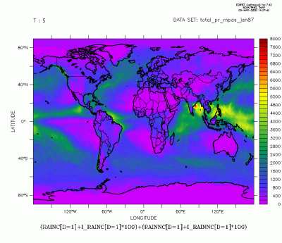

# CSCI596-FinalProject
CSCI596 Final Project<br />
Fall 2021<br />
Qingyuan Sun<br />
# Simulate Rainfall by using WRF model
**What is WRF**<br />
WRF is abbreviation of WEATHER RESEARCH AND FORECASTING MODEL<br />
- A model for climate, regional climate and weather studies
- Develop atmosphere, ocean and other eath -system simulation components


(image from:ECMWF.int)<br />

**What is the "big" problem？**<br />
How is regional precipitation in next month<br />

**Related to CSCI596**<br />
- The model envovles MPI programing
- The model running is based on GPU which is possible to accelerate the program <br />

**Source**<br />
From Los Alamos National Laboratory (COSIM) which is located in New Mexcio state<br />

**Goal**<br />
Can Produce a reasonable precipitation field<br />

# Compiling and running
**Preparation**<br />
- OpenMP
- WRF source code (https://www2.mmm.ucar.edu/wrf/users/download/get_sources.html)
- Fortran Complier
- Intel C++ Compiler
- Netcdf Complier (https://www.unidata.ucar.edu/downloads/netcdf/)
- HDF5 Datasets (https://www.hdfgroup.org/solutions/hdf5/)<br />

**load module**<br />
```
module load icc impi
```

**building and installation of ZLIB library**<br />
```
cd /lustre/home/acct-eseynq/eseynq-4/Downloads/zlib-1.2.11
LIBDIR=/lustre/home/acct-eseynq/eseynq-4/libs
./configure --prefix=${LIBDIR}
make check
make install
```

**building and installation of HDF5 library compiled by ICC with ZLIB**<br />
```
cd /lustre/home/acct-eseynq/eseynq-4/Downloads/hdf5-1.10.1 
LIBDIR=/lustre/home/acct-eseynq/eseynq-4/libs
./configure --with-zlib=${LIBDIR} --prefix=${LIBDIR} --enable-fortran --enable-cxx --enable-hl 
make check
make install
```

**installation of WRF**<br />
```
cd /lustre/home/acct-eseynq/eseynq-4/Downloads/WRFV3
./configure export NETCDF=${LIBDIR}
export LD_LIBRARY_PATH=${LIBDIR}/lib:${LD_LIBRARY_PATH}
export INCLUDE=${LIBDIR}/include/:${INCLUDE}
```

**building of NetCDF-C & NetCDF-Fortran**<br />
```
cd /lustre/home/acct-eseynq/eseynq-4/Downloads/netcdf-4.5.0
LIBDIR=/lustre/home/acct-eseynq/eseynq-4/libs
./configure --prefix=${LIBDIR} CPPFLAGS="-I${LIBDIR}/include" LDFLAGS="-L${LIBDIR}/lib"
make check
make install

cd /lustre/home/acct-eseynq/eseynq-4/Downloads/netcdf-fortran-4.4.4
LIBDIR=/lustre/home/acct-eseynq/eseynq-4/libs
export LD_LIBRARY_PATH=${LIBDIR}/lib:${LD_LIBRARY_PATH}
./configure --prefix=${LIBDIR} CPPFLAGS="-I${LIBDIR}/include" LDFLAGS="-L${LIBDIR}/lib"
make check
make install
```

**How to Complie WRF model**<br />
- Download source code from https://www2.mmm.ucar.edu/wrf/users/download/get_sources.html
```
cd WRFV3
export NETCDF=/lustre/home/esechzh/libs/netcdf
module load icc/15.0.0
module load mvapich2/icc/2.0.1
./clean –a
./configure
```
**building of libpng**<br />
```
cd /lustre/home/acct-eseynq/eseynq-4/Downloads/libpng-1.6.34
LIBDIR=/lustre/home/acct-eseynq/eseynq-4/libs
ZDIR=/lustre/home/acct-eseynq/eseynq-4/libs
./configure --prefix=${LIBDIR} CPPFLAGS="-I${LIBDIR}/include" LDFLAGS="-L${LIBDIR}/lib"
make install
```
**building of Jasper**<br />
```
cd /lustre/home/acct-eseynq/eseynq-4/Downloads/jasper-1.900.01
LIBDIR=/lustre/home/acct-eseynq/eseynq-4/libs
./configure --prefix=${LIBDIR}
make check
make install
export JASPERLIB=${LIBDIR}/lib
export JASPERINC=${LIBDIR}/include
```
**Data Preparation**<br />
- Define the running space of the model and the nesting area
  - Applying geogrid.exe in WRF source code
- Reproject data and rotate coordinates
  - Applying ungrib.exe in WRF source code
  - download climate data from https://rda.ucar.edu/datasets/ds083.2/
- Spatio-temporal interpolation of surface parameters and meteorological data
  - Applying metgrid.exe in WRF source code

**Modify Configuration File**<br />
- &time_control parameters
  - interval_seconds represents the time interval of WPS output data 
  - history_interval indicates the time interval for WRF.exe to output wrfout_dxx_* files, in minutes
  - frame_per_outfile represents the number of time frames in each wrfout_dxx_ file 
  - restart_interval indicates the time interval of restart file output, in minutes 
  - restart set whether to start running from the restart file

- &domains parameters
  - time_step represents the simulation step length of the root zone, in seconds

**Running Model**<br />
After editing namelist.wps, you need to execute the initialization program real.exe first, and you will get wrfinput_dxx and wrfbdy_d01 files. <br />
Among them, wrfinput_dxx is the state at the initial moment, wrfbdy_d01 is the side boundary state of all simulation moments in the root zone (zone 1). <br />
Then you can run the main program wrf.exe, and after the run, you will get the model output file wrfout_dxx_* file and the archive file ( restart file) wrfrst_dxx_* The wrfout_dxx_ file saves the atmospheric state simulated by the model at each moment; <br />
the wrfrst_dxx_ file is similar to the game save, and the model can continue to simulate forward based on this save.<br />

# Final Result



